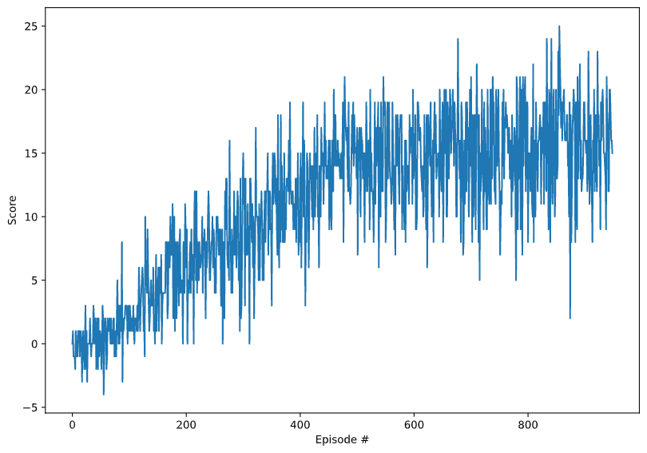

# Report of Project: Navigation

To solve the Unity Banana Environment we used the Deep-Q-Learning algorithm. To reach a better average score and imporve the learning process, we augmented the standard algorithm with the Double DQN approach.

## The Learning Algorithm
At the foundation we start with a neural network model, the so called *Q-Network*. Our network is a rather simple one, implemented in PyTorch in the `model.py` file.  
It consists of 3 fully connected layers, whereby these layers are connected with the ReLU-Activation-Function. The input and output sizes is later defined by the state and action sizes respectively.

So during the Deep-Q-Learning process, 3 concepts are used. These are *Experience Replay*, *Fixed Q-Targets* and *Double DQN*.

For *Experience Replay* we save in each timestep of an episode the current state, the reward, the action taken, the next state and if the episode terminated. With this buffer of *experience* we can replay and learn situations which are less likely to occur. For that we sample in a regular interval a batch of 64 experiences and train the neural network with that.

To improve our training further, we use a second neural network, called target network, to have *Fixed Q-Targets*. With that we can avoid harmful correlations during training. So in the regular interval mentioned above, we calculate the loss between the Q-values of the target network and the Q-values with our trained model.

Finally we try to address the overestimation of Q-values during training to improve and speed up the process. For that we use the *Double DQN* approach. So for that we select our best action during learning with our local model but evaluate that action with the weights of the target model.

The implementation of all these concepts are found in the `ddqn_agent.py` file.

## Plot of rewards
To verify that our agent has solved the environment, that means gain a score of +13 over 100 episodes, we cann look at the plot of rewards.

We can clearly see that our agent reached an even higher score of +16 over 100 episodes only after around 900 episodes.

## Ideas for future work
There are several possibilities to improve our agent and the learning process itself.  

On the one hand we could implement the concept of *Prioritized Experience Replay*. That means we also save the TD error in our Replay buffer each step and do not sample uniformly from it during training but with a sampling probability. With that we can train much more experiences with higher TD errors and try to learn and improve those situations much quicker.

On the other hand we could improve our learning with *Dueling Networks*. Instead of modeling the Q-values directly with our last layer in the model network, we can seperate the last layer into two streams. The one site tries to model the state values and the other site the advantage values (given an action). The last layer would connect these two streams and model the final Q-values as a sum of these two streams.